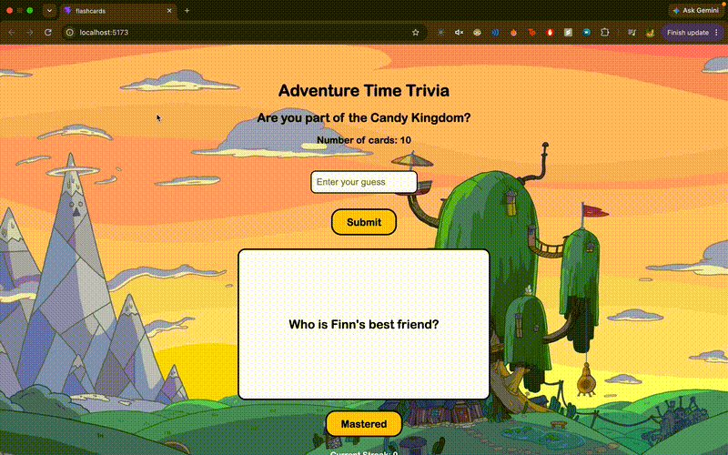

# *Adventure Time Trivia*

Submitted by: **Ana Calderon**

This web app: **An interactive Adventure Time trivia flashcard game where users can test their knowledge by submitting guesses, flip cards to reveal answers, navigate through trivia questions, track answer streaks, and mark cards as mastered.**

Time spent: **5 hours spent in total**

## Required Features

The following **required** functionality is completed:

* [x] **The app displays a title describing the theme**

  * [x] Header/title describing the theme is displayed

* [x] **A card is displayed with a question and answer**

  * [x] Only one side of the flashcard is displayed at a time
  * [x] Clicking the card flips between the question and answer

* [x] **A collection of at least 10 question/answer pairs is included**

  * [x] The app contains 10 unique Adventure Time trivia questions

* [x] **A button allows the user to view another card**

  * [x] Next and Back buttons allow users to navigate through the cards in order
  * [x] The navigation buttons are disabled at the beginning and end of the card list

* [x] **The user can submit a guess before seeing the answer**

  * [x] An input box allows users to enter their guess
  * [x] A Submit button checks the user's answer
  * [x] Correct guesses receive visual feedback
  * [x] Incorrect guesses receive visual feedback

The following **optional** features are implemented:

* [x] **The site has a custom visual theme**

  * [x] Adventure Time background image
  * [x] Custom card and button styling
  * [x] Rounded card and button designs

* [x] **The app displays the total number of cards**

  * [x] The number of available flashcards is displayed below the title

## Additional Features

The following additional features are implemented:

* [x] Case-insensitive and fuzzy answer matching allows partial answers to be accepted
* [x] Current answer streak is displayed
* [x] Longest answer streak is tracked and displayed
* [x] Users can mark cards as mastered
* [x] Mastered cards are removed from the active card list
* [x] A list of mastered cards is displayed
* [x] Flashcards are stored in an array of question/answer objects
* [x] The flashcard uses React `useState` to track its flipped state
* [x] The flashcard component uses props to display different questions and answers

## Video Walkthrough

Here's a walkthrough of the implemented features:



## Notes

One challenge I encountered was figuring out how to check whether the user's guess was part of the correct answer. I had to think through how to compare the user's input with the answer so that a guess could still be considered correct if it only included part of the answer.

I also had some difficulty figuring out how to make the Back and Next buttons work while keeping the cards randomized. I decided to change the navigation so that the cards appear chronologically, or in order, which made it easier to navigate forward and backward through the deck.

## License

Copyright 2026 Ana Calderon

Licensed under the Apache License, Version 2.0 (the "License");
you may not use this file except in compliance with the License.

You may obtain a copy of the License at

```
http://www.apache.org/licenses/LICENSE-2.0
```

Unless required by applicable law or agreed to in writing, software
distributed under the License is distributed on an "AS IS" BASIS,
WITHOUT WARRANTIES OR CONDITIONS OF ANY KIND, either express or implied.
See the License for the specific language governing permissions and
limitations under the License.

