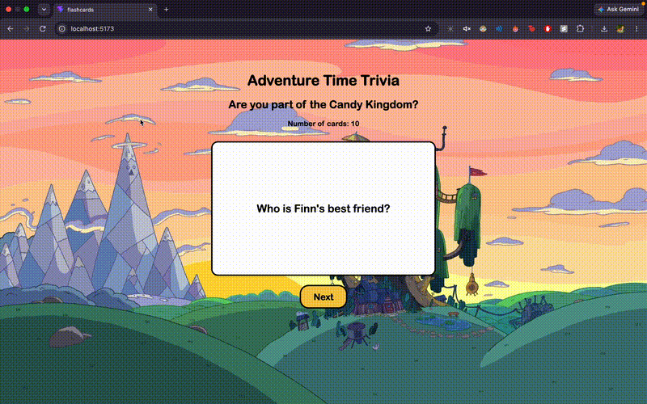

# *Adventure Time Trivia*

Submitted by: **Ana Calderon**

This web app: **An interactive Adventure Time trivia flashcard game where users can click a card to reveal the answer and use the Next button to randomly view another trivia question.**

Time spent: **3 hours spent in total**

## Required Features

The following **required** functionality is completed:

* [x] **The app displays a title describing the theme**

  * [x] Header/title describing the theme is displayed
* [x] **A card is displayed with a question and answer**

  * [x] Only one side of the flashcard is displayed at a time
  * [x] Clicking the card flips between the question and answer
* [x] **A collection of at least 10 question/answer pairs is included**

  * [x] The app contains 10 unique Adventure Time trivia questions
* [x] **A button allows the user to view another card**

  * [x] Clicking the Next button displays a randomly selected card

The following **optional** features are implemented:

* [x] **The site has a custom visual theme**

  * [x] Adventure Time background image
  * [x] Custom card and button styling
  * [x] Rounded card and button designs
* [x] **The app displays the total number of cards**

  * [x] The number of available flashcards is displayed below the title

The following **additional** features are implemented:

* [x] Flashcards are selected randomly rather than displayed in sequential order
* [x] The flashcard uses React `useState` to track its flipped state
* [x] The flashcard content is stored in an array of question/answer objects
* [x] The flashcard component uses props to display different questions and answers

## Video Walkthrough

Here's a walkthrough of implemented required features:



## Notes

One challenge I encountered was learning how to manage the flashcard's flipped state using React `useState`. I also had to implement random card selection so that clicking the Next button displays a randomly selected flashcard instead of moving through the cards sequentially. I used a separate `FlashCard` component with props for the question and answer to keep the flashcard reusable.

## License

Copyright 2026 Ana Calderon

Licensed under the Apache License, Version 2.0 (the "License");
you may not use this file except in compliance with the License.
You may obtain a copy of the License at

```
http://www.apache.org/licenses/LICENSE-2.0
```

Unless required by applicable law or agreed to in writing, software
distributed under the License is distributed on an "AS IS" BASIS,
WITHOUT WARRANTIES OR CONDITIONS OF ANY KIND, either express or implied.
See the License for the specific language governing permissions and
limitations under the License.
